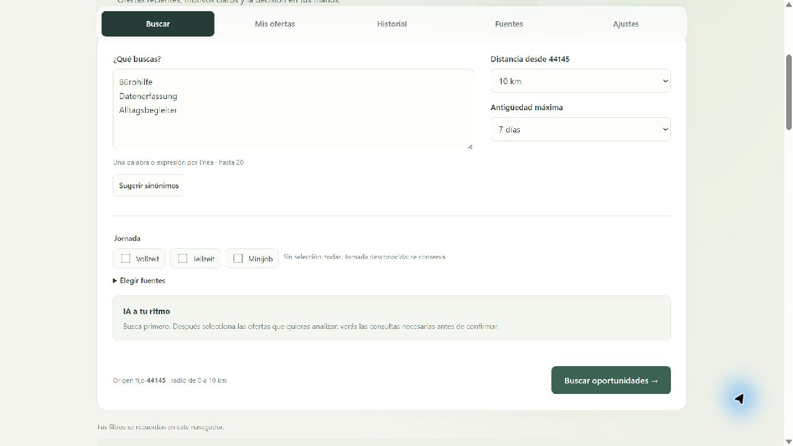
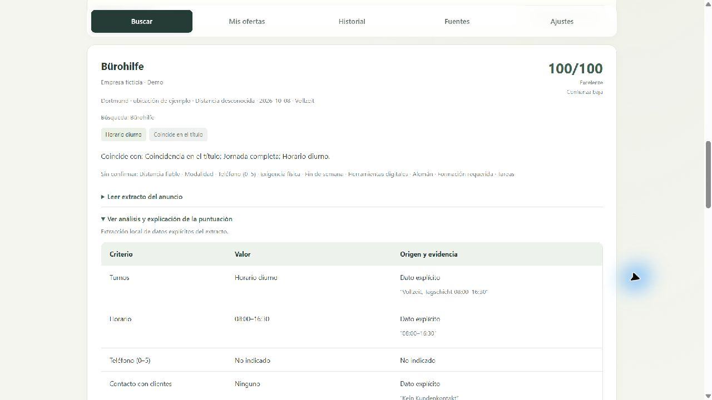
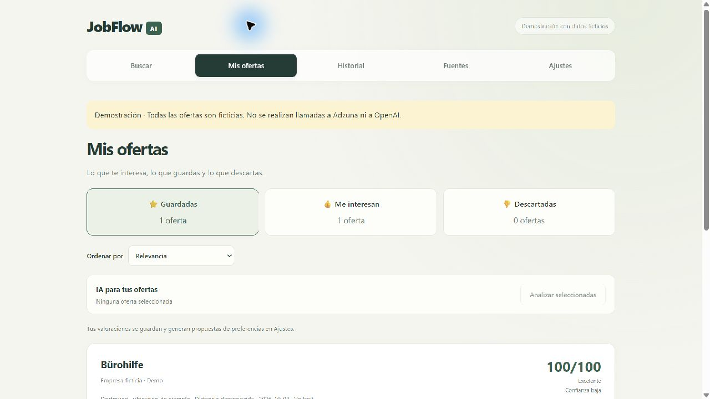
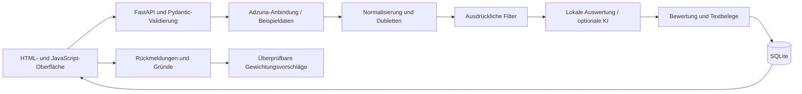

# JobFlow AI

### Jobsuche mit klaren Kriterien und nachvollziehbarer Bewertung

Persönliches Portfolio-Projekt mit **Python · FastAPI · SQLAlchemy · SQLite · JavaScript · HTML/CSS**.

[Architektur](docs/architecture.md) · [Demo-Anleitung](docs/demo.md) · [Text für den Lebenslauf](docs/cv.md) · [Datenmodell](DATA_MODEL.md)

## Einblicke in die Anwendung

Die folgenden Bilder zeigen die originale Oberfläche mit erfundenen Stellenanzeigen und einer fiktiven Favoritenliste. Für die Aufnahmen wurden Ergebnisse der lokalen Demo in einer eigenständigen Ansicht dargestellt. Es wurden keine privaten Angebote oder Notizen verwendet. Die Oberfläche ist derzeit auf Spanisch.

### Suche und Filter



### Bewertung mit Textbelegen



### Gespeicherte Stellen und Interesse



## Ausgangspunkt

Eine Suche nach Stichwörtern liefert häufig Stellenanzeigen, die einen Beruf erwähnen, aber nicht zum gesuchten Tätigkeitsbereich passen. Angaben zu Arbeitszeiten, Sprachkenntnissen, Erfahrung oder Standort können fehlen. JobFlow verbindet ausdrückliche Filter, Übereinstimmungen im Stellentitel und eine nachvollziehbare Bewertung. Die Entscheidung trifft die arbeitssuchende Person.

## Funktionen

- Stellenanzeigen über die Adzuna-API abrufen und Angaben, Datumswerte und Identitäten vereinheitlichen.
- Dubletten zusammenführen und dabei Links sowie Rückmeldungen erhalten.
- Ausschlusskriterien, persönliche Präferenzen und unbekannte Angaben getrennt behandeln.
- Übereinstimmungen im Stellentitel priorisieren; nach Relevanz oder Veröffentlichungsdatum sortieren.
- Vollzeit, Teilzeit und ausdrücklich genannte Minijobs berücksichtigen.
- Interesse, Favoriten, Ablehnungsgründe und bedingte Interessenbekundungen speichern.
- Suchfilter im Browser merken und Zähler für die einzelnen Kategorien anzeigen.
- Kleine Änderungen der Bewertungsgewichte aus Rückmeldungen vorschlagen. Änderungen müssen bestätigt werden und können rückgängig gemacht werden.
- Ausgewählte Anzeigenauszüge optional mit OpenAI analysieren. Vor der Bestätigung werden benötigte Anfragen und das verbleibende lokale Kontingent angezeigt.
- KI-Ausgaben als JSON validieren und Zitate mit dem Anzeigentext abgleichen. Bei Fehlern bleibt die lokale Auswertung verfügbar.

## Demo ohne API-Schlüssel oder API-Kosten

Voraussetzung: **Python ab Version 3.11**. Im Projektordner:

```bash
python -m venv .venv
```

**Windows:**

```powershell
.venv\Scripts\python.exe -m pip install -r requirements.txt
.venv\Scripts\python.exe demo.py
```

**macOS / Linux:**

```bash
.venv/bin/python -m pip install -r requirements.txt
.venv/bin/python demo.py
```

Anschließend **http://127.0.0.1:8799/** öffnen und die Suche starten. Die Demo verwendet erfundene Stellenanzeigen, einen getrennten Datenspeicher und die lokale Auswertung. Filter, Favoriten, Ablehnungsgründe, Bewertungen und der Verlauf lassen sich erkunden. Es werden keine Anfragen an Adzuna oder OpenAI gesendet.

**Sprachstand:** Die Projektbeschreibung und Dokumentation sind auf Deutsch. Die Benutzeroberfläche der ursprünglichen Anwendung ist derzeit auf Spanisch.

## Optionale Anbindung an externe Dienste

1. `.env.example` nach `.env` kopieren.
2. Eigene Adzuna-Zugangsdaten eintragen. OpenAI nur bei gewünschter KI-Nutzung konfigurieren.
3. In der aktivierten virtuellen Umgebung `python run.py` ausführen.
4. Die KI in den Einstellungen aktivieren und vor der Analyse die gewünschten Anzeigen auswählen.

Schlüssel werden auf dem Server verwendet. `.env`, Datenbanken, persönliche Qualifikationen, Passwörter und private Sicherungskopien sind vom Repository ausgeschlossen. Externe Dienste haben eigene Nutzungsbedingungen, Kontingente und Preise. Weitere Portale im Katalog werden als Suchlinks angeboten.

## Technischer Aufbau



Anforderungen und Produktentscheidungen entstanden aus einer persönlichen Suche nach Arbeit. Der Code wurde mit KI-Unterstützung entwickelt. Das Projekt veranschaulicht API-Anbindung, Datenmodellierung, nachvollziehbare Regeln und die Gestaltung einer Benutzeroberfläche.

## Bekannte Grenzen

- Ausgangspunkt ist die Postleitzahl 44145 in Dortmund; der Radius ist zwischen 0 und 10 km einstellbar.
- Adzuna liefert teilweise gekürzte Anzeigentexte. Pro Suche werden bis zu 50 Anzeigen berücksichtigt; eine vollständige Marktabdeckung ist nicht gewährleistet.
- Geografische Mittelpunkte ergeben geschätzte Entfernungen. Unbekannte Entfernungen bleiben als unbekannt gekennzeichnet.
- Die Anpassung an Rückmeldungen schlägt Regeländerungen vor. Es wird kein persönliches KI-Modell trainiert.
- Die Anwendung ist für eine Person ausgelegt. Online-Zugang und dauerhafte Speicherung sind im Code vorbereitet; Veröffentlichung und Prüfung eines Online-Betriebs stehen noch aus.
- Vorhandene Tests verwenden Beispieldaten und simulierte API-Aufrufe. Die enthaltenen Tests belegen keine vollständige Prüfung sämtlicher später ergänzter Funktionen.

## Projektstruktur

| Ordner | Aufgabe |
|---|---|
| `app/` | API, Regeln, Anbindungen, Speicherung, KI und Präferenzen |
| `frontend/` | Anpassungsfähige Benutzeroberfläche ohne Frontend-Framework |
| `config/` | Allgemeine Vorlagen und Erkennungsmuster |
| `fixtures/` | Erfundene Anzeigen für Demo und Tests |
| `prompts/` | Analyseanweisungen und Ausgabeschema |
| `tests/` | Vorhandene Tests mit simulierten Netzwerkaufrufen |
| `docs/` | Architektur, Demo-Anleitung und Präsentation |

## Quellen und Danksagung

Die echte Anbindung kennzeichnet Anzeigen als Inhalte von [Adzuna](https://www.adzuna.de/) und erhält deren Links. Referenzkoordinaten stammen aus [GeoNames, DE.zip](https://download.geonames.org/export/zip/DE.zip), unter [CC BY 4.0](https://creativecommons.org/licenses/by/4.0/). Die Demo-Anzeigen wurden als erfundene Beispiele für dieses Projekt erstellt.
