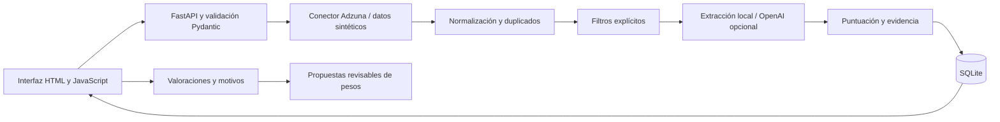

# JobFlow AI

### Un buscador de empleo con criterios claros y decisiones explicables

Proyecto personal de portfolio con **Python · FastAPI · SQLAlchemy · SQLite · JavaScript · HTML/CSS**.

[English](README.en.md) · [Arquitectura](docs/architecture.md) · [Demostración](docs/demo.md) · [Texto para CV](docs/cv.md)


## El problema

Una búsqueda por palabras clave devuelve ofertas que pueden mencionar una profesión sin corresponder a ella. Además, faltan datos sobre horario, idioma, experiencia o ubicación. JobFlow combina filtros explícitos, coincidencias de puesto y puntuación explicable para ayudar a revisar candidatos. La decisión final queda en manos de la persona que busca trabajo.

## Qué hace

- Busca ofertas mediante la API de Adzuna y normaliza campos, fechas e identidad.
- Agrupa duplicados conservando enlaces y valoraciones.
- Separa exclusiones, preferencias y datos desconocidos.
- Prioriza coincidencias del título; permite ordenar por relevancia o fecha.
- Incluye Vollzeit, Teilzeit y detección explícita de Minijob.
- Guarda interés, favoritos, descartes, motivos y explicaciones condicionales.
- Recuerda filtros en el navegador y muestra contadores por categoría.
- Propone cambios de puntuación a partir de las valoraciones; requieren aceptación y se pueden deshacer.
- Analiza extractos seleccionados con OpenAI, opcionalmente. Antes de confirmar muestra las consultas necesarias y el cupo local restante.
- Valida el JSON de la IA y comprueba que las citas aparecen en el anuncio. Un fallo conserva la extracción local.

## Probar sin claves ni costes de API

Requisitos: **Python 3.11 o posterior**. Desde la carpeta del proyecto:

```bash
python -m venv .venv
```

**Windows:**

```powershell
.venv\Scripts\python.exe -m pip install -r requirements.txt
.venv\Scripts\python.exe demo.py
```

**macOS / Linux:**

```bash
.venv/bin/python -m pip install -r requirements.txt
.venv/bin/python demo.py
```

Abrir **http://127.0.0.1:8799/** y pulsar **Buscar oportunidades**. La demo utiliza ofertas sintéticas, almacenamiento separado y extracción local. Se pueden explorar filtros, motivos, favoritos, puntuación e historial. No consulta Adzuna ni OpenAI; las funciones de IA real necesitan configuración aparte.

## Integraciones reales, opcionales

1. Copiar `.env.example` a `.env`.
2. Configurar las credenciales de Adzuna; configurar OpenAI solo si se desea usar IA.
3. Ejecutar `python run.py` con el entorno virtual activado.
4. Activar IA en Ajustes y seleccionar anuncios antes de confirmar el análisis.

Las claves se utilizan en el servidor. `.env`, bases de datos, titulaciones personales, contraseñas y copias privadas están excluidos del repositorio. Los servicios externos tienen sus propias condiciones, cuotas y facturación. El resto de portales del catálogo son enlaces de búsqueda, no fuentes importadas.

## Diseño técnico



La especificación y las decisiones de producto se desarrollaron a partir de una necesidad personal, con asistencia de IA para implementar el código. El proyecto muestra integración de APIs, modelado de datos, reglas explicables y diseño de una interfaz; no se presenta como desarrollo manual sin asistencia ni como un sistema de contratación automática.

## Límites conocidos

- El origen de esta versión es el código postal 44145, Dortmund, con radio de 0–10 km.
- Adzuna devuelve extractos parciales y se revisan hasta 50 candidatos por búsqueda. No hay cobertura completa garantizada.
- Los centroides geográficos se muestran como estimaciones; no confirman distancia exacta.
- El aprendizaje propone ajustes de reglas; no entrena un modelo personalizado.
- La aplicación está pensada para una persona. El código de acceso online y persistencia está preparado, pero el despliegue público y su comprobación quedan pendientes.
- Se incluyen pruebas de lógica y API con datos sintéticos y llamadas simuladas. La existencia de la suite no implica que cada función posterior haya sido validada de extremo a extremo.

## Organización

| Carpeta | Responsabilidad |
|---|---|
| `app/` | API, reglas, conectores, persistencia, IA y preferencias |
| `frontend/` | Interfaz adaptable sin framework de frontend |
| `config/` | Plantillas y patrones genéricos |
| `fixtures/` | Datos sintéticos para demo y pruebas |
| `prompts/` | Instrucciones y esquema de análisis |
| `tests/` | Pruebas existentes con llamadas de red simuladas |
| `docs/` | Arquitectura, capturas y presentación |

## Créditos

La integración real atribuye los anuncios a [Adzuna](https://www.adzuna.de/) y conserva sus enlaces. Las coordenadas de referencia del código postal proceden de [GeoNames, DE.zip](https://download.geonames.org/export/zip/DE.zip), bajo [CC BY 4.0](https://creativecommons.org/licenses/by/4.0/). Los anuncios de la demo son textos ficticios creados para este proyecto.
